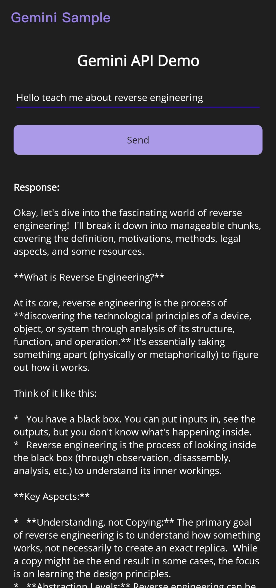

# Maui-Gemini ChatBot

This is a small .NET MAUI app that sends a text prompt to the Gemini API and shows the response on the screen.  
The app uses a basic UI.

## How to Use

1. Open the project in Visual Studio 2022.
2. Go to **MainPage.xaml.cs**.
3. Replace this line with your own API key: ***private const string ApiKey = "<Your-API-Key>"***;
4. Run the app on Android, Windows, or any supported platform.
5. Type a message and press **Send**.

## Screenshot

## Project Info

- This project uses `HttpClient` to call the Gemini API.
- The code is kept simple for learning and testing.
